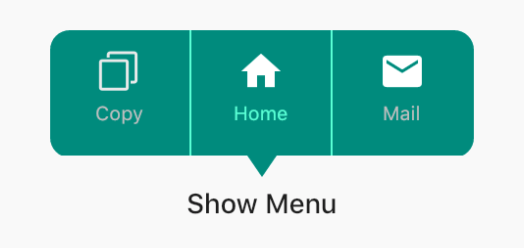
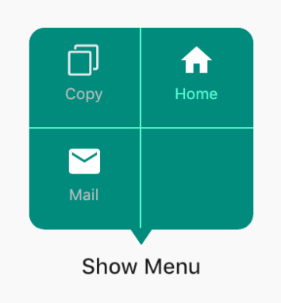
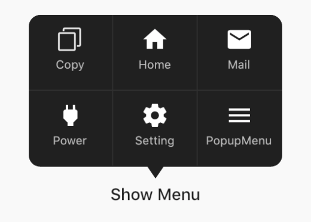

This project was writed with pure dart code，which means it's support both iOS and Android.

# ScreenShot

  

# How To Use


You can find the demo at the 'example' folder.

First, you should set the context at somewhere in you code. Like below:
```
PopupMenu.context = context;
```
```
PopupMenu menu = PopupMenu(
      items: [
        MenuItem(title: 'Copy', image: Image.asset('assets/copy.png')), 
        MenuItem(title: 'Home', image: Icon(Icons.home, color: Colors.white,)), 
        MenuItem(title: 'Mail', image: Icon(Icons.mail, color: Colors.white,)), 
        MenuItem(title: 'Power', image: Icon(Icons.power, color: Colors.white,)),
        MenuItem(title: 'Setting', image: Icon(Icons.settings, color: Colors.white,)), 
        MenuItem(title: 'Traffic', image: Icon(Icons.traffic, color: Colors.white,))], 
      onClickMenu: onClickMenu, 
      onDismiss: onDismiss);

menu.show(rect: rect);
```